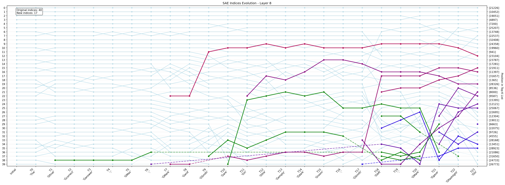
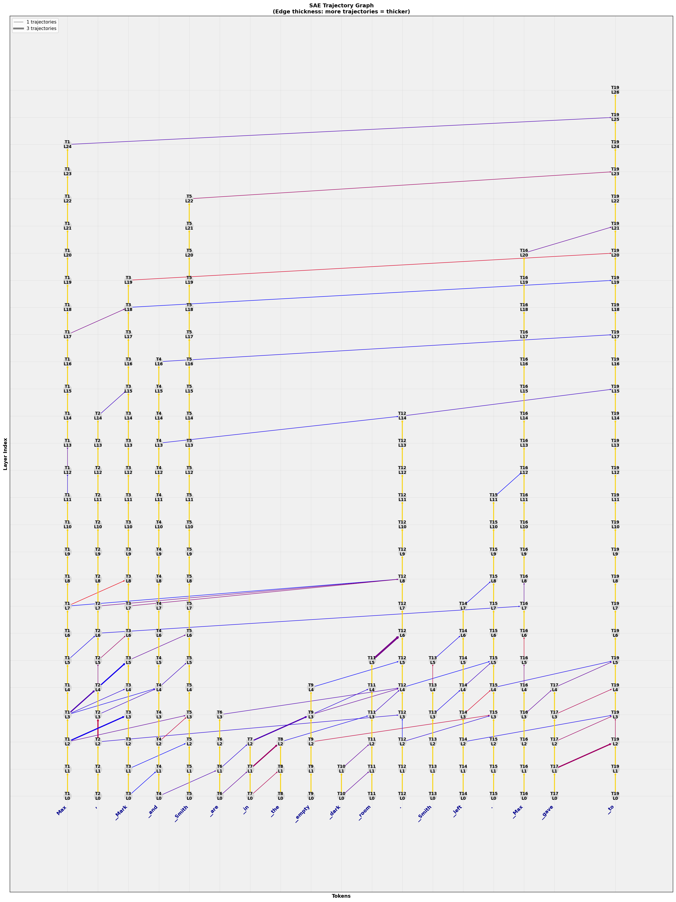

# MATS SAE Trajectory Analysis

This repository contains research code for analyzing Sparse Autoencoder (SAE) feature trajectories in transformer language models. The project is divided into two main parts:

1. **Experimental code** - Located in `sae_experiments/` directory with various analysis scripts and experiments
2. **Main pipeline** - Core trajectory analysis and graph generation tools

## Methodology: SAE Flow Detection through Attention Layers

We have developed a technique for **SAE Flow detection through Attention Layer**, based on the idea of **SAE decomposition evolution relative to attention layer contributions (token by token)**. This approach allows us to track how sparse features evolve as we process longer sequences in transformer models.


*Evolution of SAE features across different prompt lengths for layer 8*

From SAE evolutions, we identify trajectories of new features (newcomers) and create a graph structure. The resulting graph depends on the number of top-k features considered during analysis.


*Trajectory graph showing feature flow patterns*

## Implementation Details

### Models and Features
- **Model**: Gemma-2b with resid_post features (resid_mid features were not available)
- **SAE Integration**: Uses SAE-Lens library for sparse autoencoder analysis and Neuronpedia API for feature explanations.

### Core Pipeline

1. **`load_all_saes.py`** - Preloads all SAE models to CPU for efficient processing
2. **`sae9.py`** - Creates main evolutionary data patterns for all prompt lengths (from 2 to max_length). Evolution is created for top 400 parameters. 
3. **`graph_generator.py`** - Constructs trajectory graphs for top-k features (usually less then 25).

### Key Features
- **Multi-length Analysis**: Tracks feature evolution across different prompt lengths and across all attention layers.
- **Top-k Flexibility**: Configurable analysis depth (we found features around top 10-15 are often important)
- **Visualization Options**: Both PNG static plots and interactive HTML graphs with feature descriptions

### Simplifications
- BOS token contributions are excluded from visualization for clarity
- Focus on residual stream features (resid_post)

## Visualization

The project supports two types of visualization:
- **Static PNG plots** - For publication and analysis
- **Interactive HTML graphs** - With hover descriptions and feature details

## Future Work

- **MLP Integration**: Adding MLP feature analysis following the same methodology
- **Multi-layer SAE**: Implementing cross-layer feature dynamics analysis
- **Extended Model Support**: Expanding to other transformer architectures

## Usage

```bash
# Load SAE models
python load_all_saes.py

# Generate evolutionary patterns
python sae9.py

# Create trajectory graphs
python graph_generator.py

```

## Requirements

- PyTorch
- TransformerLens
- SAE-Lens
- NetworkX
- Plotly
- Matplotlib
- NumPy

## Project Structure

```
MATS_reload/
├── sae_experiments/     # Experimental analysis scripts
├── load_all_saes.py     # SAE model loading
├── sae9.py             # Main evolutionary analysis
├── graph_generator.py   # Trajectory graph creation
├── graphs1.py          # Graph analysis and visualization
├── plotly_graph.py     # Interactive visualization
├── hooked.py           # TransformerLens wrapper
└── results/            # Output directory
```

For detailed information about experimental scripts, see [sae_experiments/README.md](sae_experiments/README.md). 
